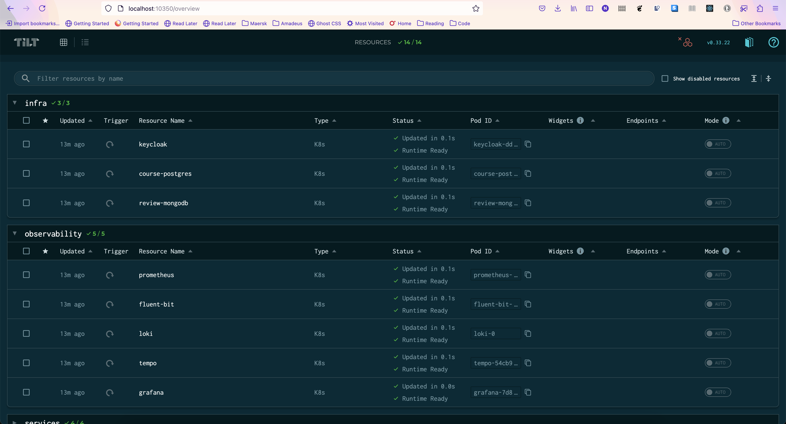

# Table of Contents

- [Prerequisites](#prerequisites)
- [Run the application](#run-the-application)
- [Guide to grafana](#guide-to-grafana)

# Container Diagram

## Description

The **Price Management System** consists of multiple Spring Boot microservices, a gateway, databases, and external
systems for observability, deployed via Docker Compose or Kubernetes (Tilt).

## Containers

| Container            | Technology           | Description                                               |
|----------------------|----------------------|-----------------------------------------------------------|
| **Gateway Service**  | Spring Cloud Gateway | Routes requests to microservices, handles load balancing. |
| **Price Service**    | Spring Boot          | Manages prices data, interacts with Mongo.                |
| **MongoDB Database** | MongoDB              | Stores review data for Review Service.                    |
| **Keycloak**         | Keycloak             | External auth server for SSO and role-based access.       |
| **Grafana**          | Grafana              | Visualization for metrics, logs, and traces.              |
| **Loki**             | Loki                 | Log aggregation system.                                   |
| **Tempo**            | Tempo                | Distributed tracing system.                               |
| **Fluent-bit**       | Fluent-bit           | Log forwarding agent.                                     |
| **Otel Collector**   | OpenTelemetry        | Collects and exports telemetry data.                      |

## Interactions

- **Users/Admin** → **Gateway Service**: HTTP requests via browser/API client.
- **Gateway Service** → **Price Service**: Routes course-related requests.
- **Price Service** ↔ **MongoDB Database**: CRUD operations for review data.
- **All Services** → **Fluent-bit**: Sends logs.
- **All Services** → **Otel Collector**: Sends metrics and traces.
- **Fluent-bit** → **Loki**: Forwards logs.
- **Otel Collector** → **Tempo**: Sends traces.
- **Otel Collector** → **Grafana**: Sends metrics.
- **Grafana** ← **Loki**: Queries logs.
- **Grafana** ← **Tempo**: Queries traces.

---

### Additional Notes

- **Tech**: Spring Boot, Spring Cloud, JPA, MongoDB driver, OTel, Fluent-bit.
- **Interactions**: REST/HTTP, JDBC, MongoDB protocol.
- **Scalability**: Kubernetes supports replicas; Docker Compose for local dev.

# Prerequisites

- **Java 17+** (Recommended for Spring Boot 3.x)
- **Maven 3.8+**
- **Docker & Docker Compose** (for local containerized deployment)
- **Minikube & Tilt** (for Kubernetes-based deployment)
- **Httpie / cURL** (for API testing)
- **Postman / Bruno**

# Run the application

You can start the application using either **Docker (Docker Compose)** or **Kubernetes (Tilt)**.

Ensure that your **Docker Engine** is running before proceeding.

### Running with Docker or Individual Services on Host OS

1. Start Persistent Services:

```shell
  cd docker && docker compose -f docker-compose-infra.yml up --build
```

This command initializes **PostgreSQL** and **MongoDB**.

2. Launch the Observability Stack:

 ```shell
    cd docker && docker compose -f docker-compose-observability.yml up --build
```

This set up **Grafana**, **Tempo**, **Loki**, **Fluent-bit**, **Prometheus**

3. Start the Microservices

```shell
    sh run.sh docker
```

or

```shell
    sh run.sh
```

This will start all microservices on their respective ports

### Running with Tilt in Kubernetes env `(Minikube)`

1. Let's Start minikube

```shell
minikube delete --profile microservice-deployment
```
```shell
    minikube start \
                --profile=microservice-deployment \
                --memory=6g \
                --cpus=4 \
                --disk-size=30g \
                --kubernetes-version=v1.27 \
                --driver=docker
```

```html
😄  [microservice-deployment] minikube v1.35.0 on Darwin 15.3.1
▪ MINIKUBE_ACTIVE_DOCKERD=microservice-deployment
👉  Using Kubernetes 1.27.16 since patch version was unspecified
✨  Using the docker driver based on user configuration
📌  Using Docker Desktop driver with root privileges
👍  Starting "microservice-deployment" primary control-plane node in "microservice-deployment" cluster
🚜  Pulling base image v0.0.46 ...
🔥  Creating docker container (CPUs=4, Memory=4096MB) ...
🐳  Preparing Kubernetes v1.27.16 on Docker 27.4.1 ...
▪ Generating certificates and keys ...
▪ Booting up control plane ...
▪ Configuring RBAC rules ...
🔗  Configuring bridge CNI (Container Networking Interface) ...
🔎  Verifying Kubernetes components...
▪ Using image gcr.io/k8s-minikube/storage-provisioner:v5
🌟  Enabled addons: storage-provisioner, default-storageclass
🏄  Done! kubectl is now configured to use "microservice-deployment" cluster and "default" namespace by default
```

2. Enable Ingress addon

```shell
    minikube addons enable ingress --profile microservice-deployment
```
```shell
  minikube addons enable metrics-server --profile=microservice-deployment
```
```markdown
💡 ingress is an addon maintained by Kubernetes. For any concerns contact minikube on GitHub.
You can view the list of minikube maintainers at: https://github.com/kubernetes/minikube/blob/master/OWNERS
💡 After the addon is enabled, please run "minikube tunnel" and your ingress resources would be available at "127.0.0.1"
▪ Using image registry.k8s.io/ingress-nginx/controller:v1.11.3
▪ Using image registry.k8s.io/ingress-nginx/kube-webhook-certgen:v1.4.4
▪ Using image registry.k8s.io/ingress-nginx/kube-webhook-certgen:v1.4.4
🔎 Verifying ingress addon...
🌟 The 'ingress' addon is enabled
```

3. Run this to make sure minikube can read images from local registry

```shell
    eval $(minikube -p microservice-deployment docker-env)
```

4. Let's build the images

```shell
    sh build-images.sh      
```

```html
Building Docker images for Kubernetes using Minikube...
Building course-composite-service...
[+] Building 31.5s (14/14) FINISHED                                                                                                                                                                            docker:default
=> [internal] load build definition from Dockerfile                                                                                                                                                                     0.0s
=> => transferring dockerfile: 871B                                                                                                                                                                                     0.0s
.
.
.
.
gateway-service built successfully!
All images built successfully!
```

5. List the images

```shell
    docker images
```

or

```shell
    docker image ls
```

```html
REPOSITORY                                           TAG        IMAGE ID       CREATED         SIZE
gateway-service                                      latest     2e07a4894e3d   3 minutes ago   339MB
review-service                                       latest     857bf2e92e8d   3 minutes ago   336MB
course-service                                       latest     ad9a018bd4a3   3 minutes ago   359MB
course-composite-service                             latest     5e1868bd77bc   3 minutes ago   328MB
registry.k8s.io/ingress-nginx/controller             <none>     ee44bc236803   5 months ago    293MB 
registry.k8s.io/ingress-nginx/kube-webhook-certgen   <none>     a62eeff05ba5   5 months ago    63.8MB 
registry.k8s.io/kube-apiserver                       v1.27.16   1113933272f1   7 months ago    123MB
registry.k8s.io/kube-controller-manager              v1.27.16   2db343b95a4c   7 months ago    115MB
registry.k8s.io/kube-scheduler                       v1.27.16   91ad8454afdd   7 months ago    57.7MB
registry.k8s.io/kube-proxy                           v1.27.16   ea1f910af975   7 months ago    79.9MB
registry.k8s.io/etcd                                 3.5.12-0   3861cfcd7c04   13 months ago   149MB
registry.k8s.io/coredns/coredns                      v1.10.1    ead0a4a53df8   2 years ago     53.6MB
registry.k8s.io/pause                                3.9        e6f181688397   2 years ago     744kB
gcr.io/k8s-minikube/storage-provisioner              v5         6e38f40d628d   3 years ago     31.5MB
```

You can also get Table view

```shell
    minikube image ls --format table --profile microservice-deployment
```

```html
|----------------------------------------------------|----------|---------------|--------|
|                       Image                        |   Tag    |   Image ID    |  Size  |
|----------------------------------------------------|----------|---------------|--------|
| docker.io/library/review-service                   | latest   | 857bf2e92e8d6 | 336MB  |
| docker.io/library/course-composite-service         | latest   | 5e1868bd77bc2 | 328MB  |
| registry.k8s.io/kube-controller-manager            | v1.27.16 | 2db343b95a4c2 | 115MB  |
| registry.k8s.io/kube-scheduler                     | v1.27.16 | 91ad8454afddc | 57.7MB |
| docker.io/library/gateway-service                  | latest   | 2e07a4894e3d5 | 339MB  |
| docker.io/library/course-service                   | latest   | ad9a018bd4a3c | 359MB  |
| registry.k8s.io/ingress-nginx/kube-webhook-certgen | <none>   | a62eeff05ba51 | 63.8MB | 
| registry.k8s.io/kube-apiserver                     | v1.27.16 | 1113933272f1e | 123MB  | 
| registry.k8s.io/kube-proxy                         | v1.27.16 | ea1f910af975c | 79.9MB |
| gcr.io/k8s-minikube/storage-provisioner            | v5       | 6e38f40d628db | 31.5MB |
| registry.k8s.io/coredns/coredns                    | v1.10.1  | ead0a4a53df89 | 53.6MB |
| registry.k8s.io/pause                              | 3.9      | e6f1816883972 | 744kB  |
| registry.k8s.io/ingress-nginx/controller           | <none>   | ee44bc2368033 | 293MB  |
| registry.k8s.io/etcd                               | 3.5.12-0 | 3861cfcd7c04c | 149MB  |
|----------------------------------------------------|----------|---------------|--------|
```

6. Let's start the Microservices

```shell
    Tilt up
```

```html
Tilt started on http://localhost:10350/
v0.33.22, built 2025-01-03

(space) to open the browser
(s) to stream logs (--stream=true)
(t) to open legacy terminal mode (--legacy=true)
(ctrl-c) to exit
```

```shell
    tilt get uiresources
```

```html
NAME                       CREATED AT
prometheus                 2025-03-11T10:37:08Z
fluent-bit                 2025-03-11T10:37:08Z
uncategorized              2025-03-11T10:37:08Z
gateway-service            2025-03-11T10:37:08Z
keycloak                   2025-03-11T10:37:08Z
review-mongodb             2025-03-11T10:37:08Z
tempo                      2025-03-11T10:37:08Z
loki                       2025-03-11T10:37:08Z
price-service              2025-03-11T10:37:08Z
grafana                    2025-03-11T10:37:08Z
(Tiltfile)                 2025-03-11T10:37:08Z
```

```shell
    kubectl get pods,svc,ingress
```


---

# Check the endpoints

> [!NOTE]
> On macOS and Windows, the Minikube ingress add-on doesn't support using the cluster's IP when running on Docker, so
> minikube tunnel --profile polar is required to expose the cluster locally via 127.0.0.1, similar to kubectl
> port-forward
> but for the entire cluster.
>```shell
>  minikube tunnel --profile microservice-deployment
>```
> Add below in your /etc/hosts
> ```shell
>   vi /etc/hosts
>```
>
> ```
>    127.0.0.1       grafana.local
> 
>    127.0.0.1       keycloak.local
> 
>    127.0.0.1       prometheus.local
> ```

| **Components** | **Docker**                   | **Kubernetes on Mac**      | Note                                           |
|----------------|------------------------------|----------------------------|------------------------------------------------|
| **Gateway**    | http://localhost:9000        | http://127.0.0.1:80        |                                                |
| **Price**      | http://localhost:8080/prices | http://127.0.0.1:80/prices |                                                |
| **Grafana**    | http://localhost:3000        | http://grafana.local       | Add `127.0.0.1 grafana.local` in /etc/hosts    |
| **Loki**       | http://loki:3100             | http://loki:3100           |                                                |
| **Tempo**      | http://tempo:3200            | http://tempo:3200          |                                                |
| **Fluent-bit** | http://fluent-bit:24224      | http://fluent-bit:24224    | http on 4318 and grpc on 4317                  |
| **Prometheus** | http://localhost:9090        | http://prometheus.local    | Add `127.0.0.1 prometheus.local` in /etc/hosts |
| **Keycloak**   | http://localhost:8081        | http://keycloak.local      | Add `127.0.0.1 keycloak.local` in /etc/hosts   |

> [!TIP]
> On Linux, Minikube runs as a native process directly on the host machine, rather than inside a virtual machine or a
> Docker container. This allows it to acquire a real, routable IP address that can be accessed from the host system
> without extra configuration.
>
> ```
>   $ minikube ip --profile microservice-deployment
>   192.154.19.8 
> ```
>
> Now, all the above tabular endpoints available at http://192.154.19.8/**

Also, please use **OpenAPI specs**, **bruno** or **postman** for API details. I will add Swagger/SpringDoc as when I get
time!!

---

# Guide to Grafana

### Accessing Loki, Tempo, Prometheus, and Dashboards in Grafana

## Step 1: Log In to Grafana

1. Open your browser and go to your Grafana instance (e.g., `http://localhost:3000`).
2. Log in with your credentials (default: `admin`/`admin`). Update the password if prompted.

---

## Step 2: Add Data Sources (Loki, Tempo, Prometheus)

Configure Loki, Tempo, and Prometheus as data sources in Grafana.

1. **Navigate to Connections**:
    - From the left sidebar, hover over the **Connections** icon (plug symbol) and click **Data sources**.  
      Or use the hamburger menu (☰) > **Connections** > **Data sources**.

2. **Add a New Data Source**:
    - Click **+ Add new data source** in the top-right corner.

3. **Configure Prometheus**:
    - Search for `Prometheus` and select it.
    - Set **Name** (e.g., "Prometheus").
    - Enter **URL** (e.g., `http://prometheus:9090`).
    - Leave defaults unless specific settings (e.g., authentication) are needed.
    - Click **Save & test**. Confirm "Data source is working."

4. **Configure Loki**:
    - Search for `Loki` and select it.
    - Set **Name** (e.g., "Loki").
    - Enter **URL** (e.g., `http://loki:3100`).
    - Optionally, set **Max lines** (e.g., 1000) under **Additional settings**.
    - Click **Save & test**. Verify it works.

5. **Configure Tempo**:
    - Search for `Tempo` and select it.
    - Set **Name** (e.g., "Tempo").
    - Enter **URL** (e.g., `http://tempo:3200`).
    - Optionally, link to Loki for trace-to-log correlation via **Derived Field** (e.g., match `traceID=(\w+)`).
    - Click **Save & test**. Ensure it’s operational.

---

## Step 3: Access via Explore

Use the **Explore** view to query data directly from Loki, Tempo, and Prometheus.

1. **Open Explore**:
    - Click the **Explore** icon (compass) in the left sidebar, or use the hamburger menu (☰) > **Explore**.

2. **Select a Data Source**:
    - Use the dropdown at the top to choose:
        - **Prometheus**: Metrics (e.g., `rate(http_server_requests_seconds_count[5m])`).
        - **Loki**: Logs (e.g., `{job="fluent-bit"} |= "error"`).
        - **Tempo**: Traces (e.g., search by trace ID or service).

3. **Run Queries**:
    - **Prometheus**: Enter a PromQL query and click **Run query**. View as graph or table.
    - **Loki**: Use LogQL or the **Builder** tab to filter logs. Click **Run query** for logs or metrics.
    - **Tempo**: Input a trace ID or use the **Search** tab (filter by service, duration, tags). View trace
      visualizations.

4. **Switch Views**:
    - Toggle between **Logs**, **Graph**, or **Traces** tabs above the results.

---

## Step 4: Access and Create Dashboards

Visualize data from Loki, Tempo, and Prometheus using dashboards.

1. **View Existing Dashboards**:
    - Click the **Dashboards** icon (four-square grid) in the sidebar.
    - Select **Browse** to see available dashboards (e.g., from `Spring Boot 3.x Statistic`).

2. **Create a New Dashboard**:
    - Go to **Dashboards** > **+ New** > **New dashboard**.
    - Click **+ Add visualization**.
    - Choose a data source (Prometheus, Loki, or Tempo).
    - Add queries:
        - **Prometheus**: Metric query (e.g., `http_server_requests_seconds_count`), visualize as Graph.
        - **Loki**: Log query (e.g., `{job="fluent-bit"}`), use **Logs** or **Time series**.
        - **Tempo**: Grab a Trace ID or search query, visualize as a trace timeline.
    - Customize panels and click **Apply**.

3. **Save the Dashboard**:
    - Click the **Save** icon (floppy disk) in the top-right.
    - Name and save the dashboard.

4. **Import Pre-Built Dashboards**:
    - Go to **Dashboards** > **+ New** > **Import**.
    - Upload JSON files provided in the directory /grafana-dashboard.
    - Map data sources and import.

---

### Spring Boot Observability Dashboard


### Spring Boot Statistic Dashboard


### Tempo Traces


### Loki Logs


---
